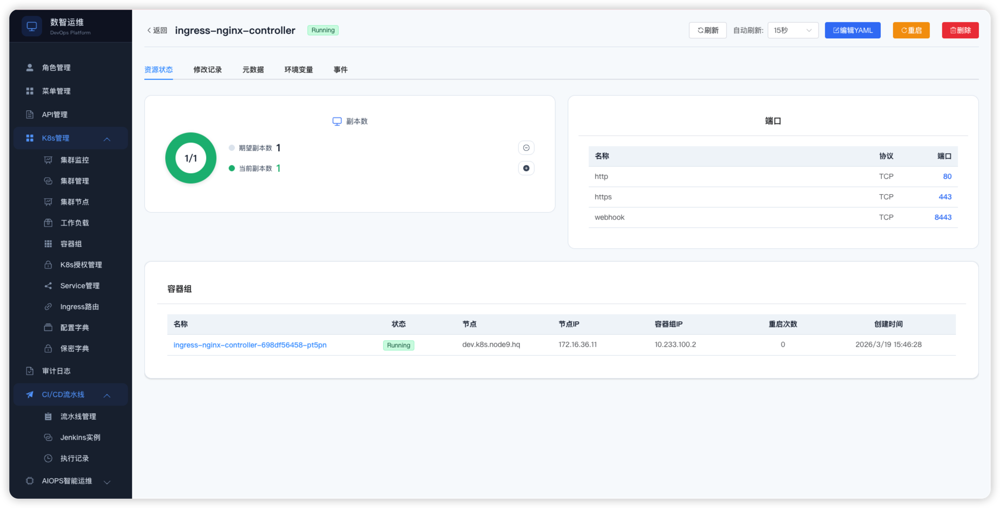
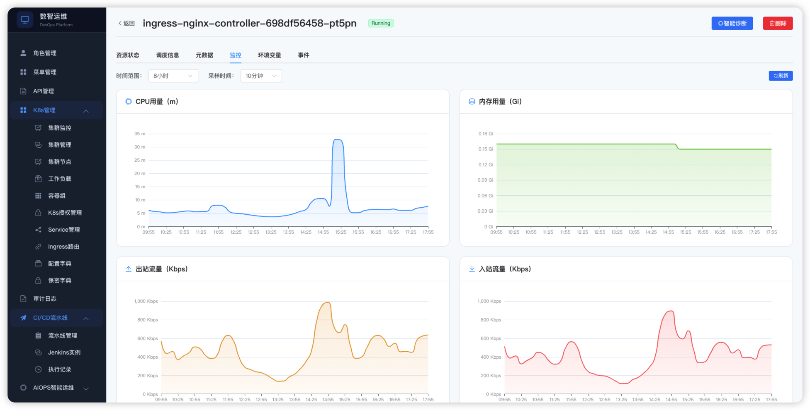

# DevOps 平台

一个基于 Go + Vue3 的 DevOps 管理平台，包含用户管理、角色管理、权限管理模块。

## 技术栈

### 后端
- Go 1.20
- Gin (Web框架)
- GORM v2 (ORM)
- MySQL 8.0
- JWT认证

### 前端
- Vue 3
- Element Plus
- Vue Router
- Axios

## 快速开始

### 本地开发

1. **启动数据库**
```bash
# 使用Docker启动MySQL
docker run -d --name devops-mysql \
  -e MYSQL_ROOT_PASSWORD=password \
  -e MYSQL_DATABASE=devopsdb \
  -p 3306:3306 \
  mysql:8.0

# 或使用已有MySQL实例
mysql -uroot -p -e "CREATE DATABASE devopsdb;"
```

2. **启动后端**
```bash
cd backend
cp .env.example .env
go mod tidy
go run main.go
```

后端将在 http://localhost:8080 启动

3. **启动前端**
```bash
cd frontend
npm install
npm run dev
```

前端将在 http://localhost:5173 启动

### Docker Compose 部署

```bash
docker-compose up -d
```

访问 http://localhost:3000

## API 文档

### 认证
- `POST /api/login` - 登录
- `POST /api/register` - 注册

### 用户管理
- `GET /api/users` - 获取用户列表
- `POST /api/users` - 创建用户
- `PUT /api/users/:id` - 更新用户
- `DELETE /api/users/:id` - 删除用户
- `POST /api/users/:id/roles` - 为用户分配角色

### 角色管理
- `GET /api/roles` - 获取角色列表
- `POST /api/roles` - 创建角色
- `PUT /api/roles/:id` - 更新角色
- `DELETE /api/roles/:id` - 删除角色
- `POST /api/roles/:id/permissions` - 为角色分配权限

### 权限管理
- `GET /api/permissions` - 获取权限列表
- `POST /api/permissions` - 创建权限

## 环境变量

### 后端
```
MYSQL_URL=root:password@tcp(127.0.0.1:3306)/devopsdb?charset=utf8mb4&parseTime=True&loc=Local
JWT_SECRET=your-secret-key
```

## 项目结构

```
devops-platform/
├── backend/              # 后端代码
│   ├── main.go          # 主程序
│   ├── go.mod           # Go依赖
│   ├── Dockerfile       # 后端Docker配置
│   └── .env.example     # 环境变量示例
├── frontend/            # 前端代码
│   ├── src/
│   │   ├── views/       # 页面组件
│   │   ├── router/      # 路由配置
│   │   ├── App.vue      # 根组件
│   │   └── main.js      # 入口文件
│   ├── package.json     # 前端依赖
│   └── Dockerfile       # 前端Docker配置
├── docker-compose.yml   # Docker编排配置
├── AGENTS.md            # OpenCode指令文件
└── README.md            # 项目文档
```

## 截图





## 开发指南

参见 `AGENTS.md`